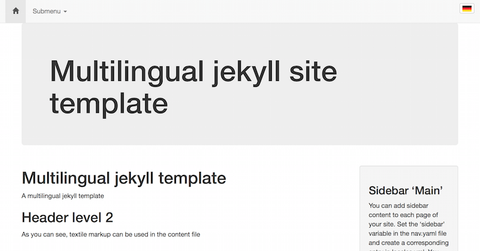
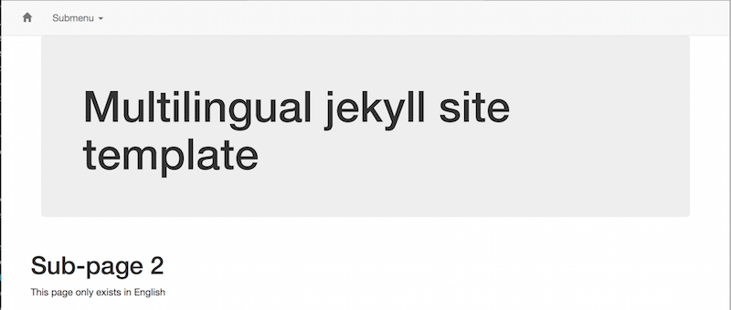
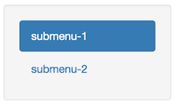

# Template for multilingual jekyll site

## Intention

I was busy converting a number of sites from joomla! to jekyll. Since some of them were multilingual, I was facing the challenge to implement a handy solution for that with jekyll, so I created this template.

## Usage

* You'll need [jekyll](http://jekyllrb.com) to use this template
* Download all files in a directory on your local machine
* adjust `_config.yml`: set your desired destination directory for the rendered site
 * use `jekyll build` to build the site
 * deploy the site to a html server or use a local webserver and view it on your localhost
* as an alternative, you can use `jekyll serve` (if you have a html server on your machine)

The site should look like this:  
----

----
## Features

* Dynamic language selector
** The language selector contains only _really_ selectable languages for the specific site. If no content in a language is defined for one site, the language will not appear in the selector  


* Automatic sidebar  
the sidebar can contain up to 3 components:
 * Subnavigation menu  
When a page, which makes part of a subnavigation group is displayed, in the sidebar, there will automatically appear a menu with all pages of this subnavigation group  

 * Secondary navigation  
In the navigation control file, more than one navigation trees can be defined. The "main" tree is used for the nav bar, whilst all others can be used to be displayed in the sidebar of certain pages
 * Sidebar mini article  
In the navigation file, a content section can be set as "sidebar-main". If done so, the content will appear in a box in the sidebar
* Customizeable headlines  
In the contents file, a section for headlines can be included in order to have a big headline over all pages (bootstrap jumbotron).

## Architecture

### YAML content <a id="yaml-content"></a>
For the transation of content, it is handy to have the texts in several languange together in one file, so cross checks can be done easily. 

I decided to keep the whole content in a yaml file (--> `_data/locales.yml`). For each page in the site, it keeps a record of the form: 

```yaml
# entry for the index page
index:
    # english version
    en:
        # the title is used as the site title as well as for the first header in the content
        title: Multilingual jekyll template
        # main can contain textile markup. In order to keep the line feeds, use the pipe sign 
        main: |
            A multilingual jekyll template
            
            h2. Header level 2
            
            As you can see, textile markup can be used in the content file
    de:
        title: Mehrsprachige jekyll Vorlage
        main: |
            Ein Template für mehrsprachige jekyll Web-Seiten
            
            h2. Überschrift 2
            
            Textile markup kann verwendet werden
main-sub:
    # Submenu headers do not have content, so the "main" variable is not necessary here
    en:
        title: Submenu
#(...)
````

It starts with a key I call `base-url`. This is the file-name for the corresponding page without the type suffix. So the record shown above is intended for the `index.html`of the rendered site.

The language dependant sections (`de:`, `en:`) refer to the language versions of the page. We'll come back to this later.

The "title" var is used for the page title. This template also displays it in a `h1`tag at the top of the page.

Since I decided to use `textile` as markdown renderer, the "main" branch of the content is included with the "textilize" filter. Therefore, you can use textile markup in the content

### Language control file
Another yaml data file (`_data/languages.yml`) is used to control the multilingual functionality. 

```yaml
---
  - lang: de
    postfix: "-de"
    image: flag-de.jpg
    description: deutsch
  - lang: en
    postfix: ""
    image: flag-en.jpg
    description: English
```

The "postfix" variable is used to access the various languages for one base-url. Note that the language with the emtpy postfix is the default language. 

The two language versions of the index page are though:
* `index.textile` for the english version (which is default)
* `index-de.textile` for the german version

The "image" variable indicates the flag image for the language selector.

### Navigation control file
The file `_data/nav.yaml` controls the navigation of the site.

```yaml
# This is the main navigation tree that appears in the upper nav bar
main:
      # an icon from bootstrap's "glyphicon-" set. Here, it will be expanded to "glyphicon-home"
    - icon: home
      # the url-base is used to construct the file name including the language suffix
      # i.e. this entry stands for the files index.html, index-en.html, index-de.html
      # see _data/languages.yml for the language settings
      url-base: index
      sidebar: sidebar-main
      # this option makes a secondary menu appear on the right. It is possible to declare multiple secondary menu trees. See the "secondary" tree below
      sidemenu: secondary
    - title: # this one has a title in addition to the icon. The title is multilingual
        en: Submenu
        de: Untermenü
      url-base: submenu
      subpages: 
        - title:
            en: submenu-1
            de: Untermenü-1
          url-base: sub-1
        - title: 
            en: submenu-2
            de: Untermenü-2
          url-base: sub-2
# an additional menu, that can be activated as a secondary menu on the right. See option "sidemenu" in the items of the main tree
secondary:
    - title:
        en: Side menu 1
#(...)
```

The template supports submenus up to one level of nesting. They will appear as dropdown menus in the navigation bar. Besides the "main" branch of the hierarchy, you can add one or more secondary branches that can appear as a secondary navigation menu in the sidebar setting the "sidemenu" option of a page.

The "title" subtree is used for the navigation link. It contains texts in the various languages supported by the page. The language selector will only show buttons for languages that are specified in this subtree. Since the actual language is not displayed in the language selector, a page without a title in a foreign language will not have any language selector.

### Skeleton page files

For the rendering of the site, it is important to have one file for each language version of each page. In this template, the following skeleton files are used:

* index.textile  
The main page in default language
* index-de.textile  
Main page in german language
* subpages.textile  
Header entry for the submenu in main nav
* sub-1.textile  
First submenu entry in default lang
* sub-1-de.textile  
First submenu entry in German

and so on.

The contents of these files are rather similar:

```
---
layout: default
url-base: index
lang: en
---



```

As you see, there is front matter defining the layout (in the template, only one default layout is used), the language and the base url (see [YAML content](#yaml-content)). After the front matter, always the same include is used to build the page.

Here's the content of `_includes/page-simple.textile`:

```


h1. {{pgdata.title}}

{{pgdata.main}}
```

As you see, the file is pretty simple. In the first line, an assign is used to fetch the corresponding content from `locales.yml`. Then the title is rendered as a header `h1`, followd by the main content.

Of course, you could decide to use more than one page include in order to have several templates for pages. 

To be clearly, here's another file content for `side-1-sub-2-de.textile`:

```
---
layout: default
url-base: side-1-sub-1
lang: de
---


```

### the default layout
Most of the programming work has been done in the `_layouts/default.html` file and its includes. All names of the includes used in this file begin with `layout-default-`. 

## Bootstrap
I used [bootstrap][1]. Especially the navigation features, the grid and the responsive functionality is important. You can use the basic files or even a customized variant and include it in the `css` and `js` directories.

### Responsive functionality
The default layout contains a responsive navbar which will collapse when the viewport gets too tiny. I used the template from [bootstrap][1] that can be found in the components document section.

### custom css
In the `css/custom.css` file, there are two adjustments for the language selector


[1](http://getbootstrap.com)
